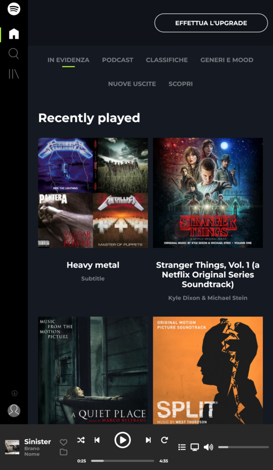
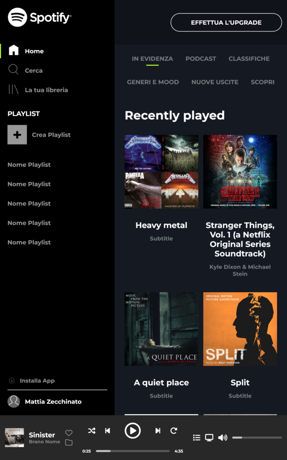
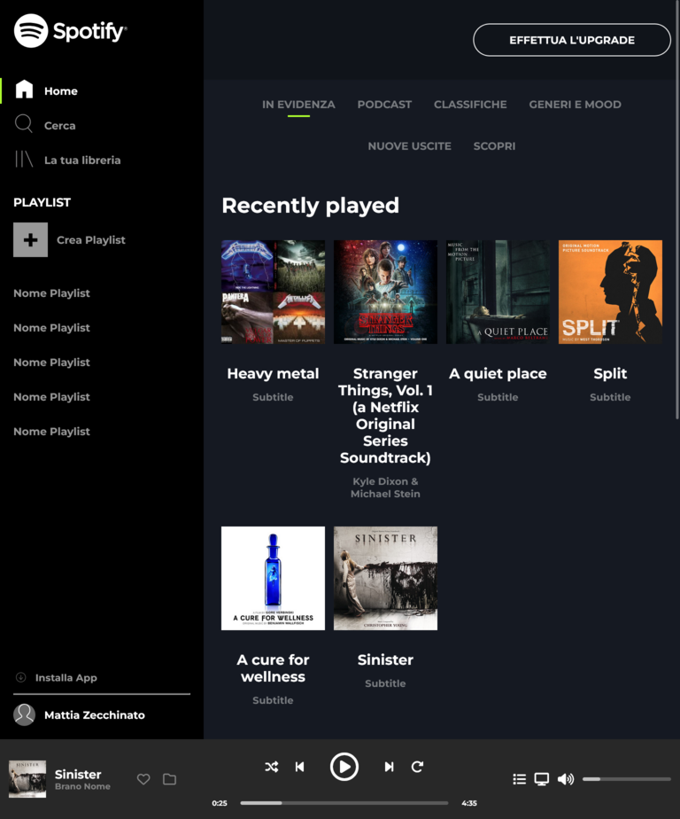

# Spotify

## Descrizione

Questa applicazione web, riproduce il sito di [Spotify](https://open.spotify.com/).

## Struttura della pagina

- **TOP PAGE**
    - Left bar
        - Logo
        - Nav bar per navigare nelle varie sezioni(Home, Cerca, La tua libreria)
        - Bottone per la creazione delle playlist playlist
        - Lista delle proprie playlist
        - Bottone per scaricare l'apllicazione
        - L'account con cui si ha effettuato il login
    - Right bar
        - Top
            - Bottone per l'iscrizionew premium
        - Bottom
            - Nav bar per navigare nelle varie playlist
            - Playlist recenti
            - Playlist create in base ai gusti dell'utente
            - Artisti più popolari
- **BOTTOM PAGE**
    - Sezione del brano in ascolto
        - Immagine del brano
        - Titolo e autore
        - Icone per aggiungere il brano ai preferiti
    - Stato del brano
        - Bottoni per
            - Riproduzione casuale dei brani
            - Skip brano precente
            - Stop/Avvio
            - Skip brano successivo
            - Ripetizione del brano
    - Controllo dispositivi e volume
        - Bottoni per
            - Pagina in dettaglio del brano
            - Cambiare la riproduzione del brano sui vari dispositivi collegati all'account
            - Mutare/Riattivare l'audio
        - Barra per regolare il volume
    
## Linguaggi utilizzati

- HTML (struttura della pagina)
- CSS (stile della pagina)

## Features

- Il sito è in responsive e si adatta ai seguenti dispositivi:
    - mobile

      
    - mobile xl (>=576px)
    
      
    - tablet (>=768px)
    
      
    - desktop (>=992px)
    
      

## Autori

- [@Mattia Zecchinato](https://www.github.com/MattiaZecchinato)